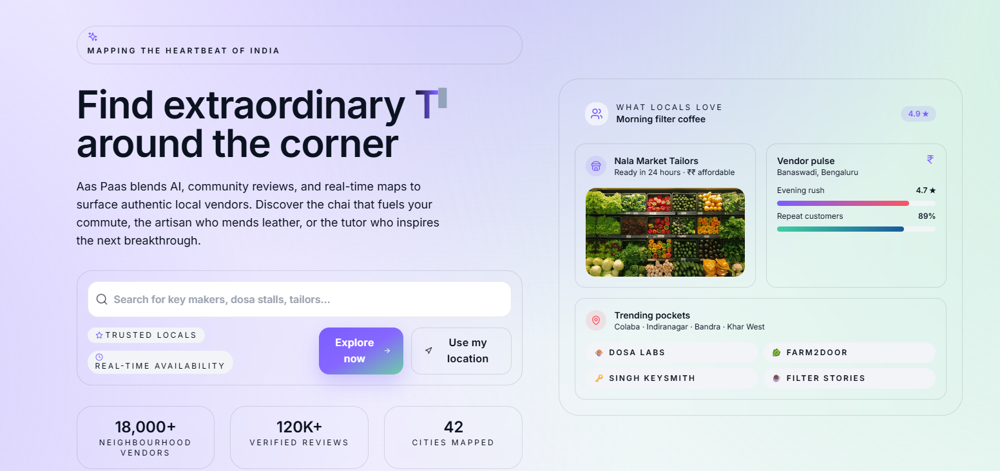
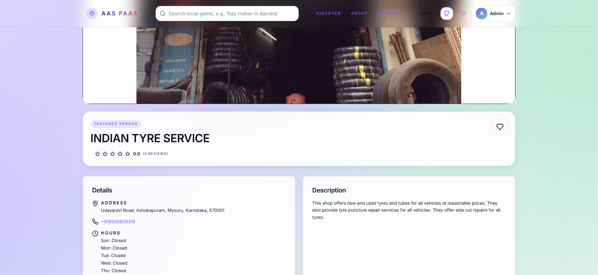
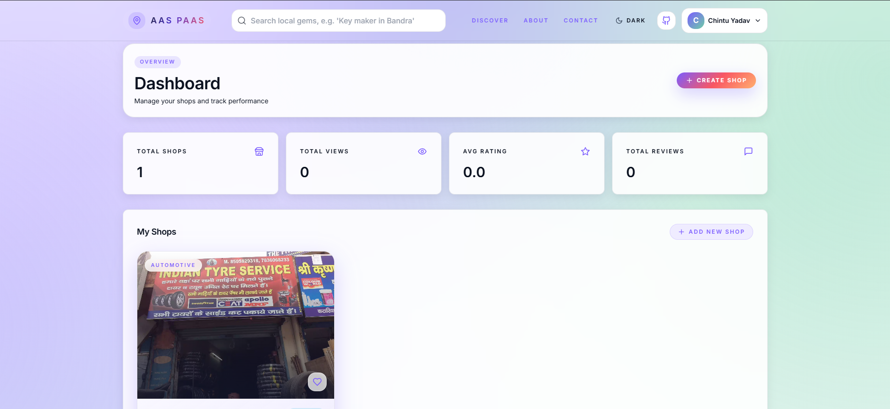
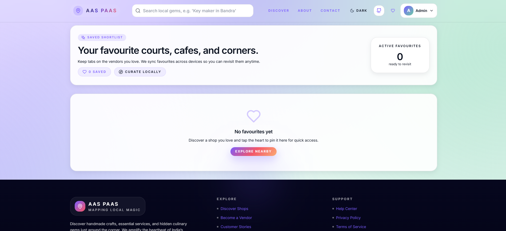
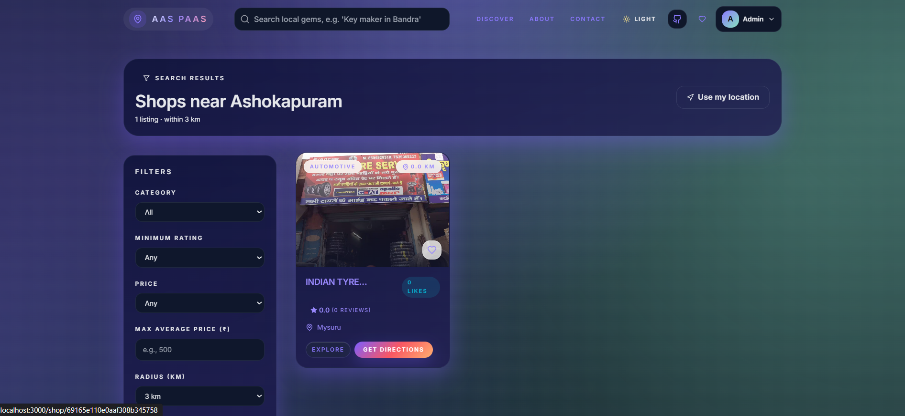

Here is a **polished, professional, beautifully formatted README.md**, upgraded with emojis, tables, improved structure, clearer explanations, visual organization, and expandable sections.
It is ready to paste directly into your repo.

---

# ✨ **AasPaas – Mapping The Heartbeat of India**

A modern platform that connects **nearby customers** with **local micro-vendors** — cobblers, tea stalls, momo shops, key-makers, tailors, and more.
AasPaas makes local businesses **discoverable, reviewable, and reachable** with a seamless, map-based experience.

🌐 **Live Demo:**
👉 [https://aaspaas-ij41.onrender.com](https://aaspaas-ij41.onrender.com)

---

## 🎬 **Screenshots**

### 🖼️ Screenshots


| Page                        | Preview                                                      |
| --------------------------- | ------------------------------------------------------------ |
| 🏠 **Home / Search**        |                          |
| 🏪 **Shop Detail with Map** |            |
| 🧑‍🔧 **Vendor Dashboard**  |  |
| ⭐ **Reviews & Favorites**   |                |
| 🌙 **Dark Mode**            |                     |

---

# ✨ **Features**

### 🔎 **Smart Discovery**

* Category-based browsing (food, repair, services, etc.)
* Location-aware search (Map/List toggle)
* Auto-complete search bar

### 🧾 **Vendor Onboarding**

* OCR-powered shop detail extraction
* Upload shop photos → auto-suggest name/category
* Vendor console to edit shop details, visibility, timings

### ⭐ **Engagement**

* Customer reviews with photos
* Favorite shops
* “Helpful” upvotes
* Average rating system

### 🧭 **Geospatial Power**

* Nearby shop search
* Integrated Google Maps directions
* Distance + ETA preview

### 🔐 **Authentication**

* JWT-based auth (Access + Refresh tokens)
* Vendor, Customer, Admin roles
* Secure cookie/LS token flow

### 🤖 **AI Helpers (Optional)**

* OCR (Tesseract.js)
* Shop category classification
* Text extraction
* Gemini-based enhancements

---

# 🧱 **Tech Stack**

### 🖥️ **Frontend**

| Tech              | Purpose                       |
| ----------------- | ----------------------------- |
| ⚛️ React + Vite   | Fast UI development           |
| 🎨 TailwindCSS    | Utility-first styling         |
| 🔄 Redux Toolkit  | Global state management       |
| 🚦 React Router   | Routing                       |
| 📡 TanStack Query | Server state fetching/caching |
| 🗺️ Mapbox/Mappls | Maps + geolocation            |

---

### 🛠️ **Backend**

| Tech                  | Purpose                                |
| --------------------- | -------------------------------------- |
| 🟩 Node.js + Express  | REST API                               |
| 🍃 MongoDB + Mongoose | Database                               |
| 🧰 Redis              | Caching, queues                        |
| 📮 BullMQ             | Background jobs (OCR, auto-processing) |
| 🔑 JWT                | Auth                                   |
| ✂️ Sharp              | Image resize/optimize                  |
| 👓 Tesseract.js       | OCR engine                             |
| 🤖 Gemini API         | Optional AI help                       |

---

### ⚓ **DevOps**

| Tool                | Purpose         |
| ------------------- | --------------- |
| 🐳 Docker & Compose | Containers      |
| 🚀 Render           | Deployment      |
| 🔧 render.yaml      | Infra-as-config |

---

# 📦 **Monorepo Structure**

```
.
├── backend/                   # Express API, DB, OCR, queues
│   ├── src/
│   │   ├── models/            # Mongoose schemas
│   │   ├── controllers/       # Route handlers
│   │   ├── routes/            # API routes
│   │   ├── middleware/        # Auth, validation, CORS, logging
│   │   ├── utils/             # Helpers
│   │   ├── services/          # OCR, AI, file operations
│   │   └── app.js             # Express setup
│   ├── Dockerfile
│   ├── .env.example
│   └── seed.js
│
├── frontend/                  # React + Vite
│   ├── src/
│   │   ├── components/        # UI components
│   │   ├── pages/             # Pages (home, vendor, shops)
│   │   ├── store/             # Redux store
│   │   ├── hooks/             # Custom hooks
│   │   ├── api/               # API calls
│   │   └── styles/            # Tailwind + theme
│   ├── public/
│   ├── Dockerfile
│   └── index.html
│
├── docker-compose.yml
└── README.md
```

---

# 🚀 **Quick Start**

## Option A — ⭐ Docker Compose (recommended)

```bash
docker compose up --build
```

### Services exposed:

| Service         | URL                                            |
| --------------- | ---------------------------------------------- |
| 🗄️ MongoDB     | localhost:27017                                |
| 🚦 Redis        | localhost:6379                                 |
| 🛠️ Backend API | [http://localhost:5000](http://localhost:5000) |
| 🖥️ Frontend    | [http://localhost:3000](http://localhost:3000) |

---

## Option B — Manual Setup

### 1️⃣ Backend

```powershell
cd backend
npm install
```

Create `backend/.env`:

```env
MONGO_URI=mongodb://localhost:27017/aas-paas
PORT=5000
JWT_SECRET=change-this-32+chars
JWT_REFRESH_SECRET=change-this-32+chars
FRONTEND_URL=http://localhost:3000

# Optional
REDIS_URL=redis://localhost:6379
GOOGLE_VISION_ENABLED=false
MAPPLE_API_KEY=your-mappls-key
GEMINI_API_KEY=your-gemini-key
GEMINI_MODEL=gemini-3.6-flash
```

Run backend:

```bash
npm run dev
```

---

### 2️⃣ Frontend

```powershell
cd frontend
npm install
```

Create `.env.local`:

```env
VITE_API_URL=http://localhost:5000/api
VITE_MAPPLS_MAP_SDK_KEY=your-mappls-key
# VITE_MAPBOX_TOKEN=your-token
```

Run frontend:

```bash
npm run dev
```

---

### 3️⃣ Optional — Seed database

```bash
cd backend
npm run seed
```

---

# 🧪 **Testing**

| Area                  | Command                   |
| --------------------- | ------------------------- |
| 🧠 Backend (Jest)     | `cd backend && npm test`  |
| 🖥️ Frontend (Vitest) | `cd frontend && npm test` |
| 🧪 E2E (Playwright)   | `npm run test:e2e`        |

---

# ⚙️ **Environment Notes**

* Frontend reads API base from `VITE_API_URL`
* Default: `http://localhost:5000/api`
* Docker Compose auto-wires all services (Mongo, Redis, Frontend, Backend)

---

# 📷 **Persistent Image Storage – Cloudinary Integration**

To prevent shop images from resetting to a default on Render redeploys, all new uploads are now stored in **Cloudinary** (CDN + persistent storage). The application automatically prefers Cloudinary if its credentials are present; otherwise it falls back to S3 (if configured) or ephemeral local storage (development only).

## ✅ What Changed
* Images are uploaded with `uploadImage()` via Cloudinary when `CLOUDINARY_*` env vars are set.
* Shop image records now include optional `publicId` for future transformations & deletion.
* Moving images from a temporary "pending" location into `shops/<shopId>` now uses Cloudinary rename instead of filesystem/object copy.

## 🔐 Required Environment Variables (Backend)
Add these to Render dashboard or `backend/.env`:
```env
CLOUDINARY_CLOUD_NAME=your_cloud_name
CLOUDINARY_API_KEY=your_api_key
CLOUDINARY_API_SECRET=your_api_secret
# Optional folder prefix for organizational purposes
CLOUDINARY_FOLDER=shops
```

Do NOT commit real secrets. The frontend never receives API secret values.

## 🖼 Rendering Images
Use the stored `image.url` directly. You may append Cloudinary transformation segments on demand (e.g. thumbnail vs hero):
```
https://res.cloudinary.com/<cloud>/image/upload/w_300,h_300,c_fill,q_auto,f_auto/<publicId>
```
Fallback: If `image.url` missing/invalid, render a graceful placeholder (e.g. a patterned SVG or themed default).

---

# 🛠 **Migration: Local/S3 → Cloudinary**

Existing shops pointing to local `/uploads/...` or S3 URLs can be migrated automatically.

## Modes
| Mode     | Env | Behavior |
| -------- | --- | -------- |
| Dry Run  | `DRY_RUN=true` | Logs intended migrations without uploading or modifying DB |
| Full Run | (omit DRY_RUN) | Uploads legacy images to Cloudinary and updates `shop.images[].url` + `publicId` |

## Run Migration
```bash
cd backend
# Dry run first
DRY_RUN=true node src/scripts/migrateShopImagesCloudinary.js
# Execute for real
node src/scripts/migrateShopImagesCloudinary.js
```

## Idempotency & Safety
* Already-migrated (Cloudinary) URLs are skipped.
* Missing legacy files are logged and left unchanged; you can notify vendors manually.
* Script can be re-run safely after partial failures.

## Rollback Strategy
If you need to revert a problematic migration:
1. Restore MongoDB from backup (recommended pre-migration step).
2. Or selectively edit affected shop documents reverting `images[].url` to previous value (if still accessible).
3. Optionally delete newly uploaded Cloudinary assets via dashboard using `publicId`.

## Monitoring
The migration logs to standard output via winston. For production, aggregate logs (e.g. Render log stream) and search for `[migrate]` tags.

---

# 📘 **Cloudinary Runbook (Summary)**
1. Set env vars in staging.
2. Deploy backend.
3. Run dry-run migration; review counts.
4. Run full migration; verify sample shops.
5. Update frontend to ensure it uses `shop.images[0].url` (already implemented).
6. Promote to production; repeat dry-run/full-run.
7. Remove any obsolete local `uploads/` volumes from Render settings.

---

---

# 🚢 **Deployment**

AasPaas supports:

* 🟦 **Render** (recommended)
* 🐳 **Docker Image Deployment**
* 🟢 **Static Hosting** (frontend)

Render config includes:

* `render.yaml`
* Dockerfiles for frontend & backend
* Auto-deploy on Git push (branch: main)

---

# 👤 **Author**

**Aharnish Dubey (aharnish5)**
🔗 GitHub: [https://github.com/aharnish5/](https://github.com/aharnish5/)

---

# 🎉 **Enjoy Building with AasPaas!**

This project is designed to celebrate India’s vibrant micro-business ecosystem and bring local shops online with ease.
Feel free to open issues, contribute, or suggest improvements!
